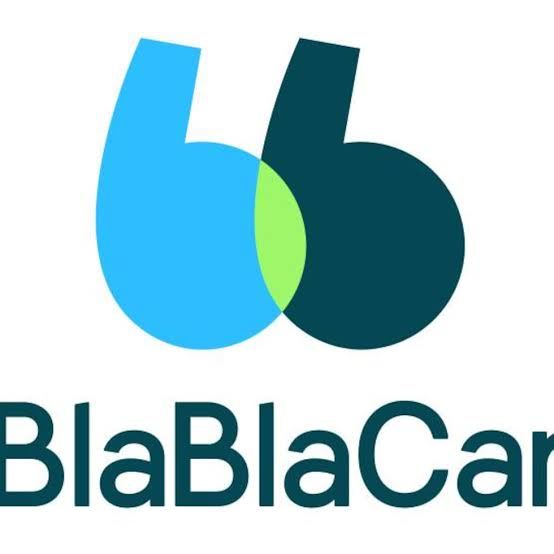

  
# *Proyecto BlaBlacar*

## ¿Que es BlaBlacar? 

BlaBlaCar es una plataforma de viajes compartidos que conecta a conductores con asientos libres y a pasajeros que van hacia el mismo destino. Fue fundada en 2006 en Francia por Frédéric Mazzella, Nicolas Brusson y Francis Nappez, y en 2020 estaba dirigida por Brusson, cofundador y CEO desde 2016.
Su modelo es asset-light: la empresa no tiene vehículos ni conductores propios, sino que funciona como un marketplace comunitario. Con el tiempo pasó de ser solo una aplicación de carpooling (funciona como una aplicacion de viaje en carro como Uber pero compartido con mas usuarios) a ofrecer una propuesta multimodal, con BlaBlaBus para los viajes en autobús y BlaBlaLines para los trayectos cortos del día a día.

.

## ***Momento del boom***

  
 Antes del Covid-19 

    En 2019 transportó cerca de 70 millones de pasajeros entre carpooling y autobús, y sus ingresos aumentaron un 71 % respecto al año anterior. Era el líder del carpooling en Europa y tenía una presencia importante en países como Brasil, México, India, Ucrania y Rusia.
La apuesta estratégica de ese momento era consolidar la oferta multimodal, combinando coche y autobús en una sola plataforma para viajes de media y larga distancia.

 Durante Pandemia 

BlaBlaCar suspendió BlaBlaBus en toda Europa y, aunque mantuvo el carpooling en Francia con el visto bueno del Ministerio de Transportes, la actividad cayó a solo el 1–2 % de lo normal en BlaBlaCar y entre el 5 y el 10 % en BlaBlaLines. Durante la emergencia la empresa eliminó su comisión, bajo una lógica de ayuda mutua.
El panorama fue desigual según el país: Rusia e India prohibieron el carpooling, mientras que Brasil y México todavía permitían viajar en autobús. En Francia la plataforma se detuvo durante el confinamiento y reanudó a fines de mayo, con un solo pasajero por viaje hasta finales de junio.

 Su reaccion ante la situacion 

BlaBlaCar reaccionó rápido desde el inicio de la crisis: recortó costos, protegió a su equipo y se mantuvo en contacto con su comunidad. Durante el primer confinamiento lanzó además BlaBlaHelp, una aplicación gratuita de ayuda entre vecinos que permitía ofrecerse como voluntario o encontrar personas de confianza para hacer compras de primera necesidad o recoger medicamentos.
La compañía también apostó por la confianza de los usuarios, aplicando protocolos sanitarios y destacando que el carpooling reduce el número de contactos entre personas en comparación con otros medios de transporte.

 Recuperacion 

En abril, Brusson preparaba a sus equipos para una reanudación muy lenta, de entre 12 y 18 meses, pero desde fines de junio la demanda de pasajeros volvió con fuerza. En agosto, las solicitudes en Francia superaban en un 15 % las del verano anterior, ayudadas por las vacaciones dentro del país y por la menor oferta de trenes, autobuses y aviones. La oferta de conductores volvió algo más despacio que la demanda.
Fuera de Europa el golpe fue menor. Brasil, Mexico, India y Ucrania tuvieron restricciones menos estrictas, y en países como Rusia e India la crisis empujó la compra de pasajes de autobús en línea. Con todo, el segundo trimestre se dio por perdido y el segundo confinamiento volvió a frenar el impulso: BlaBlaBus se detuvo el 1 de noviembre y no regresaría hasta la primavera, así que la empresa volcó sus esfuerzos en el carpooling para cerrar el año.

## Resultados

El año cerró con 50 millones de pasajeros frente a unos 70 millones en 2019, lo que representó el primer año de decrecimiento de la empresa. Aun así, mantuvo más del 70 % de su actividad, un resultado notable considerando que paso por el año de cuarentena debdido al Covid'19.

| Indicador | Usuarios|
|---------|---------|
| Pasajeros 2019| 70 millones|
| Pasajeros 2020 | 50 millones|
| Varianza| -30%|
|Actividad mantenida| mas del 70% en comparacion al año anterior|

Los mercados fuera de Europa, como Brasil, México, India y Ucrania, tuvieron menos restricciones más flexibles lo que conllevo a que, la crisis acelerara la compra de pasajes de autobús en línea en países como Rusia e India, donde antes la mayoría se compraba en la estación.

.

